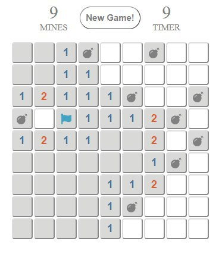

# Minesweeper Typescript
A simple minesweeper game written in typescript. You can read [here](https://en.wikipedia.org/wiki/Minesweeper_(video_game)) for more information about minesweeper game.



## Development Getting Started
These instructions will get you a copy of the project up and running on your local machines for development. Suppose you are only interested in installing this on your server, you can skip this section after Prerequisites.

### Prerequisites
#### Clone this repository
```sh
git clone https://github.com/alvinmatias69/minesweeper.git
```

#### Install the dependency
using yarn
```sh
yarn install
```

using npm
```sh
npm install
```

### Running Test
TODO: add unit test

### Running development server
```sh
npm run dev
```

## Build For Production
```sh
npm run build
```

Built apps are stored in `./dist` folder. Simply serve the `index.html` to run the apps.

## Project TODO's
* Add Testing
* Add difficulty setting

**Matias Alvin 2018**